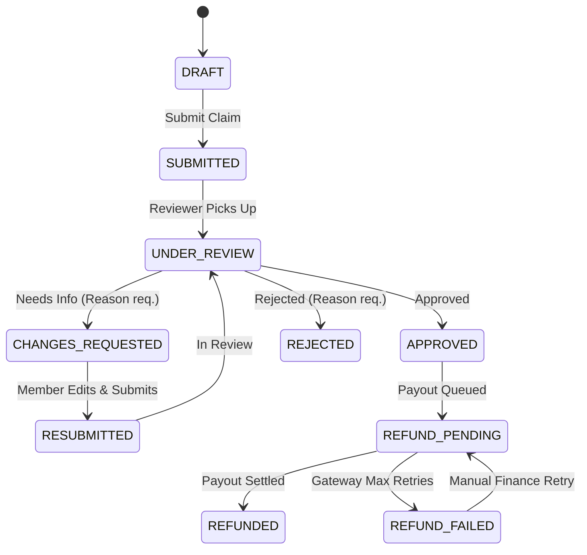

# Centralised Expense & Refund Management System (CRS)

[](https://www.typescriptlang.org/)
[](https://nextjs.org/)
[](https://firebase.google.com/)
[](https://cloudinary.com/)

A production-grade, secure, multi-tenant enterprise Expense & Refund Management System. The platform enables organizations to manage employee expense claims, structured approval workflows, pre-signed receipt storage, settlement disbursements, concurrency safety, financial idempotency, and automated failure recovery.

---

## 1. Project Overview

CRS is designed around the core principle that **the client is never trusted with financial state changes**. Simple queries and reads are serviced securely via granular Firestore Security Rules, while all state transitions, approvals, rejections, change requests, reimbursement disbursements, role modifications, and audit logs are governed by **Firebase Cloud Functions** and **Firestore Transactions**.

---

## 2. Technology Stack

### Frontend
- **Framework**: Next.js 14+ (App Router, Server & Client Components)
- **Language**: TypeScript (Strict Mode)
- **State & Caching**: TanStack React Query v5
- **Form Management**: React Hook Form with Zod validation
- **Styling & UI**: Tailwind CSS, Lucide Icons, Radix-inspired accessible modals, badges, and timeline steppers

### Backend & Cloud Services
- **Authentication**: Firebase Authentication (Session handling, password resets)
- **Database**: Cloud Firestore (Tenant-scoped collections, transactional locking, composite indexes)
- **Serverless Compute**: Firebase Cloud Functions v2 (TypeScript domain services)
- **Storage**: Cloudinary Storage / AWS S3 abstraction via pre-signed upload & download URLs
- **Payment Abstraction**: Pluggable `RefundProvider` interface with exponential backoff & failure simulation (`SUCCESS`, `FAILURE`, `TIMEOUT`)

---

## 3. System Architecture & Request Flow

```text
                  ┌────────────────────────────────────────┐
                  │          Next.js App Router UI         │
                  │   (TanStack Query + RHF + Zod + TS)    │
                  └───────────────┬────────────────────────┘
                                  │
                   ┌──────────────┴──────────────┐
                   │ Firebase Auth (Session JWT) │
                   └──────────────┬──────────────┘
                                  │
          ┌───────────────────────┴───────────────────────┐
          │                                               │
          ▼ (Direct Safe Reads via Security Rules)        ▼ (Sensitive Mutations / Financial Ops)
┌───────────────────────────────┐           ┌──────────────────────────────────────────┐
│       Cloud Firestore         │           │         Firebase Cloud Functions         │
│  - Multi-tenant collections   │◄──────────┤  - RBAC policy enforcement               │
│  - Append-only audit logs     │           │  - State machine transition validations  │
│  - Strict Firestore rules     │           │  - Firestore transactions                │
└───────────────────────────────┘           │  - Idempotency locks                     │
                                            └──────────────┬───────────────────────────┘
                                                           │
                                            ┌──────────────┴──────────────┐
                                            │                             │
                                            ▼                             ▼
                            ┌────────────────────────────┐ ┌─────────────────────────────┐
                            │    Cloudinary / S3 Storage │ │    Mock Refund Provider     │
                            │  - Pre-signed Uploads      │ │  - Async retry / Backoff    │
                            │  - Pre-signed Downloads    │ │  - Configurable outcomes    │
                            │  - Private ACL only        │ │    (SUCCESS/FAILURE/TIMEOUT)│
                            └────────────────────────────┘ └─────────────────────────────┘
```

---

## 4. Multi-Tenancy Architecture

All operational data is strictly scoped under individual organization documents:

```text
organisations/{organisationId}
├── members/{userId}
├── expenses/{expenseId}
│   ├── receipts/{receiptId}
│   └── approvals/{approvalId}
├── reimbursements/{reimbursementId}
├── auditLogs/{auditId}
└── invitations/{invitationId}

idempotencyKeys/{key}
users/{userId}
```

Tenant isolation is enforced across three distinct layers:
1. **Firestore Security Rules**: Checks `isOrgMember(orgId)` on all reads and writes.
2. **Callable Auth Middleware**: Asserts token validity and verifies document existence in `organisations/{orgId}/members/{uid}`.
3. **Transaction Repositories**: Guarantees mutations remain strictly within the caller's tenant boundary.

---

## 5. Role-Based Access Control (RBAC) Matrix

| Permission / Action | ADMIN | FINANCE | REVIEWER | MEMBER |
| :--- | :---: | :---: | :---: | :---: |
| **Create & Submit Own Expenses** | ✅ | ✅ | ✅ | ✅ |
| **Edit Own DRAFT Expenses** | ✅ | ✅ | ✅ | ✅ |
| **View Own Expenses** | ✅ | ✅ | ✅ | ✅ |
| **View All Org Expenses** | ✅ | ✅ | ✅ | ❌ |
| **Approve / Reject Claims** | ✅ | ❌ | ✅ | ❌ |
| **Request Expense Changes** | ✅ | ❌ | ✅ | ❌ |
| **Initiate Reimbursement Payouts** | ✅ | ✅ | ❌ | ❌ |
| **Retry Failed Payouts** | ✅ | ✅ | ❌ | ❌ |
| **Invite & Manage Members** | ✅ | ❌ | ❌ | ❌ |
| **Inspect Immutable Audit Logs** | ✅ | ✅ | ❌ | ❌ |
| **Configure Org Settings** | ✅ | ❌ | ❌ | ❌ |

---

## 6. Strict Expense State Machine



---

## 7. Storage Layer Architecture (Cloudinary Storage / S3)

### Why Cloudinary / S3 External Storage?
1. **Private & Compliant Media Handling**: Receipts and PDF invoices are stored privately behind authentication.
2. **Provider Agnosticism**: Cloudinary and AWS S3 share a unified `StorageProvider` interface without altering business logic.
3. **Private Access Control**: Download links use time-limited (15-minute) pre-signed delivery URLs generated only after verifying the user's organization membership and role permissions.

### Upload Flow:
1. Submitter selects file in frontend $\rightarrow$ browser computes SHA-256 checksum.
2. Client calls `generateReceiptUploadUrl` $\rightarrow$ Cloud Function generates a signed upload endpoint with signature, API key, and timestamp.
3. Signed `PUT`/`POST` URL returned $\rightarrow$ browser uploads directly to Cloudinary authenticated storage.
4. Metadata attached to expense record via `confirmReceiptUpload`.

---

## 8. Concurrency Safety & Optimistic Locking

When two reviewers view the same `UNDER_REVIEW` claim simultaneously and attempt conflicting actions (e.g. Reviewer A clicks *Approve* while Reviewer B clicks *Reject*):
1. Both operations execute inside `db.runTransaction()`.
2. The first transaction commits and mutates status to `APPROVED`.
3. The second transaction encounters the modified state during its initial read, detects that the state is no longer `UNDER_REVIEW`, and fails immediately with `INVALID_STATE_TRANSITION`.
4. Conflicting double-decisions are strictly impossible.

---

## 9. Financial Idempotency Strategy

Duplicate network requests (or double clicks on payout buttons) could result in double payouts without idempotency.
- All payout endpoints require a unique `idempotencyKey`.
- Record structure in `idempotencyKeys/{key}`:
  ```typescript
  {
    key: string;
    organisationId: string;
    userId: string;
    operation: string;
    requestHash: string; // SHA-256 of sorted params
    status: 'PENDING' | 'COMPLETED' | 'FAILED';
    result?: Record<string, unknown>;
    expiresAt: Timestamp;
  }
  ```
- If an identical key with status `COMPLETED` is presented again, the cached result is returned immediately without creating another reimbursement document or hitting the payment gateway.

---

## 10. Refund Provider Abstraction & Failure Recovery

The system decouples payout orchestration using the `RefundProvider` interface:
```typescript
export interface RefundProvider {
  createRefund(request: RefundRequest): Promise<RefundResult>;
  getRefundStatus(providerReference: string): Promise<RefundResult>;
}
```

### Mock Provider Simulation Modes:
- `SUCCESS`: Settles immediately with reference `MOCK_TXN_...` $\rightarrow$ transitions claim to `REFUNDED`.
- `FAILURE`: Returns bank rejection $\rightarrow$ executes exponential backoff retries ($200\text{ms} \times 2^n$) up to 3 attempts $\rightarrow$ marks claim `REFUND_FAILED`.
- `TIMEOUT`: Simulates HTTP 504 gateway timeout to verify network fault tolerance.

### Manual Recovery:
Finance managers can review failed refunds on `/reimbursements` and trigger manual retries with fresh idempotency keys.

---

## 11. Multi-Signal Duplicate Expense Detection

Duplicate claims are flagged in real-time by evaluating 4 matching vectors:
1. **Exact Amount & Currency Match**
2. **Receipt SHA-256 Checksum Match** (Identical file uploaded)
3. **Same Merchant Name**
4. **Same Incurred Date & Submitter**

When a duplicate is suspected, the system sets `duplicateWarning: { isDuplicate: true, matchingExpenseId: ... }` and displays an inspection link on the reviewer dashboard without deleting the original expense.

---

## 12. Immutable Audit Logging

Every sensitive state transition, member change, or payout attempt appends a permanent log entry to `organisations/{orgId}/auditLogs/{auditId}`:
```typescript
{
  id: string;
  organisationId: string;
  actorId: string;
  actorEmail: string;
  action: AuditAction;
  entityType: 'EXPENSE' | 'REIMBURSEMENT' | 'MEMBER' | 'ORGANISATION';
  entityId: string;
  before: Record<string, unknown> | null;
  after: Record<string, unknown> | null;
  timestamp: Timestamp;
  requestId: string;
}
```
Client writes to `auditLogs` are blocked in `firestore.rules`. Logs can only be written by the Cloud Functions Admin SDK.

---

## 13. Local Setup & Emulators

### Prerequisites
- Node.js $\ge 18$
- Java Runtime Environment (for Firebase Emulators)

### Installation
```bash
# 1. Clone the repository
git clone <repo-url>
cd amrita_task

# 2. Install dependencies for functions and frontend
npm run dev:functions &
cd frontend && npm install
```

### Running with Firebase Emulators
```bash
# Start Firebase Auth, Firestore, and Functions emulators
npm run dev:emulators

# In another terminal, run the database seed
npm run seed

# Start Next.js development server
npm run dev:frontend
```
Open [http://localhost:3000](http://localhost:3000) to view the application.

---

## 14. Demo Accounts & 1-Click Credentials

| Organization | Role | Email | Password |
| :--- | :--- | :--- | :--- |
| **Acme Corp (Org A)** | ADMIN | `admin@acmecorp.com` | `password123` |
| **Acme Corp (Org A)** | FINANCE | `finance@acmecorp.com` | `password123` |
| **Acme Corp (Org A)** | REVIEWER | `reviewer@acmecorp.com` | `password123` |
| **Acme Corp (Org A)** | MEMBER | `member@acmecorp.com` | `password123` |
| **Globex Inc (Org B)** | ADMIN | `admin@globex.com` | `password123` |
| **Globex Inc (Org B)** | MEMBER | `member@globex.com` | `password123` |

*The login page includes 1-click shortcut buttons for instant authentication into any of these personas.*

---

## 15. Automated Test Suite

Run unit and integration test suites:
```bash
# Run backend functions unit tests
npm run test:unit

# Run full integration and security tests
npm run test:integration
```

---

## 16. Important Engineering Decisions

1. **Integer Smallest Monetary Units**: All monetary values are represented as integer cents/paise (e.g. `$45.50` stored as `4550`) to eliminate floating-point arithmetic errors.
2. **Transaction Boundaries**: State transitions, approval document creation, and audit logging happen within single atomic transactions.
3. **Pre-signed Upload / Download Model**: Eliminates server bottleneck for receipt binaries while preserving zero-trust authorization.
4. **Idempotency Locking**: Protects financial endpoints from double-charging and race conditions.
