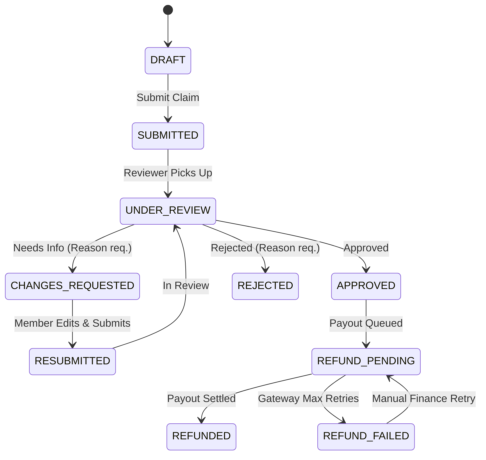

# Centralised Expense & Refund Management System (CRS)

[](https://www.typescriptlang.org/)
[](https://nextjs.org/)
[](https://supabase.com/)
[](https://cloudinary.com/)

A production-grade, secure, multi-tenant enterprise Expense & Refund Management System. The platform enables organizations to manage employee expense claims, structured approval workflows, pre-signed receipt storage, settlement disbursements, concurrency safety, financial idempotency, and automated failure recovery.

---

## 1. Project Overview

CRS is designed around the core principle that **the client is never trusted with financial state changes**. Simple queries and reads are serviced securely via granular **Postgres Row Level Security (RLS)**, while all state transitions, approvals, rejections, change requests, reimbursement disbursements, role modifications, and audit logs are governed by robust backend API routes and database constraints. All monetary values are strictly processed and displayed in **INR (₹)**.

---

## 2. Technology Stack

### Frontend
- **Framework**: Next.js 14+ (App Router, Server & Client Components)
- **Language**: TypeScript (Strict Mode)
- **State & Caching**: TanStack React Query v5
- **Form Management**: React Hook Form with Zod validation
- **Styling & UI**: Tailwind CSS, Lucide Icons, Modern Dark/Warm Theme with premium aesthetic (Inter font, sleek layout).

### Backend & Cloud Services
- **Authentication**: Supabase Auth (Session handling, password resets, secure JWTs)
- **Database**: Supabase PostgreSQL (Tenant-scoped tables, foreign key constraints, RLS policies, trigger-based updates)
- **API**: Next.js API Routes (Server-side validation, secure service-role execution)
- **Storage**: Cloudinary Storage / AWS S3 abstraction via pre-signed upload & download URLs
- **Payment Abstraction**: Pluggable `RefundProvider` interface with exponential backoff & failure simulation (`SUCCESS`, `FAILURE`, `TIMEOUT`)

---

## 3. System Architecture & Request Flow

```text
                  ┌────────────────────────────────────────┐
                  │          Next.js App Router UI         │
                  │   (TanStack Query + RHF + Zod + TS)    │
                  └───────────────┬────────────────────────┘
                                  │
                   ┌──────────────┴──────────────┐
                   │ Supabase Auth (Session JWT) │
                   └──────────────┬──────────────┘
                                  │
          ┌───────────────────────┴───────────────────────┐
          │                                               │
          ▼ (Direct Safe Reads via RLS)                   ▼ (Sensitive Mutations / Financial Ops)
┌───────────────────────────────┐           ┌──────────────────────────────────────────┐
│      Supabase PostgreSQL      │           │            Next.js API Routes            │
│  - Multi-tenant foreign keys  │◄──────────┤  - RBAC policy enforcement               │
│  - Append-only audit logs     │           │  - State machine transition validations  │
│  - Strict RLS policies        │           │  - Service-role elevated privileges      │
└───────────────────────────────┘           │  - Idempotency locks                     │
                                            └──────────────┬───────────────────────────┘
                                                           │
                                            ┌──────────────┴──────────────┐
                                            │                             │
                                            ▼                             ▼
                            ┌────────────────────────────┐ ┌─────────────────────────────┐
                            │    Cloudinary / S3 Storage │ │    Mock Refund Provider     │
                            │  - Pre-signed Uploads      │ │  - Async retry / Backoff    │
                            │  - Pre-signed Downloads    │ │  - Configurable outcomes    │
                            │  - Private ACL only        │ │    (SUCCESS/FAILURE/TIMEOUT)│
                            └────────────────────────────┘ └─────────────────────────────┘
```

---

## 4. Multi-Tenancy Architecture

All operational data is strictly scoped via `organisation_id` foreign keys in PostgreSQL:

- `organisations` (Tenants)
- `members` (Join table linking users to orgs with Roles)
- `expenses` (Claims scoped to org)
- `reimbursements` (Payouts scoped to org)
- `audit_logs` (Immutable logs scoped to org)

Tenant isolation is enforced across three distinct layers:
1. **PostgreSQL RLS Policies**: Asserts `is_org_member(org_id)` on all reads.
2. **API Route Middleware**: Asserts token validity and verifies database existence in `members` table before allowing mutations.
3. **Foreign Key Constraints**: Guarantees data integrity and cascades deletions.

---

## 5. Role-Based Access Control (RBAC) Matrix

| Permission / Action | ADMIN | FINANCE | REVIEWER | MEMBER |
| :--- | :---: | :---: | :---: | :---: |
| **Create & Submit Own Expenses** | ✅ | ✅ | ✅ | ✅ |
| **Edit Own DRAFT Expenses** | ✅ | ✅ | ✅ | ✅ |
| **View Own Expenses** | ✅ | ✅ | ✅ | ✅ |
| **View All Org Expenses** | ✅ | ✅ | ✅ | ❌ |
| **Approve / Reject Claims** | ✅ | ❌ | ✅ | ❌ |
| **Request Expense Changes** | ✅ | ❌ | ✅ | ❌ |
| **Initiate Reimbursement Payouts** | ✅ | ✅ | ❌ | ❌ |
| **Retry Failed Payouts** | ✅ | ✅ | ❌ | ❌ |
| **Invite & Manage Members** | ✅ | ❌ | ❌ | ❌ |
| **Inspect Immutable Audit Logs** | ✅ | ✅ | ❌ | ❌ |
| **Configure Org Settings** | ✅ | ❌ | ❌ | ❌ |

---

## 6. Strict Expense State Machine



---

## 7. Storage Layer Architecture (Cloudinary Storage / S3)

### Why Cloudinary / S3 External Storage?
1. **Private & Compliant Media Handling**: Receipts and PDF invoices are stored privately behind authentication.
2. **Provider Agnosticism**: Cloudinary and AWS S3 share a unified `StorageProvider` interface without altering business logic.
3. **Private Access Control**: Download links use time-limited (15-minute) pre-signed delivery URLs generated only after verifying the user's organization membership and role permissions.

---

## 8. Financial Idempotency Strategy

Duplicate network requests (or double clicks on payout buttons) could result in double payouts without idempotency.
- All payout endpoints require a unique `idempotencyKey`.
- Handled efficiently to ensure that a cached result is returned immediately without double-charging the payment gateway.

---

## 9. Refund Provider Abstraction & Failure Recovery

The system decouples payout orchestration using the `RefundProvider` interface.

### Mock Provider Simulation Modes:
- `SUCCESS`: Settles immediately with reference `MOCK_TXN_...` $\rightarrow$ transitions claim to `REFUNDED`.
- `FAILURE`: Returns bank rejection $\rightarrow$ executes exponential backoff retries ($200\text{ms} \times 2^n$) up to 3 attempts $\rightarrow$ marks claim `REFUND_FAILED`.
- `TIMEOUT`: Simulates HTTP 504 gateway timeout to verify network fault tolerance.

### Manual Recovery:
Finance managers can review failed refunds on `/reimbursements` and trigger manual retries with fresh idempotency keys.

---

## 10. Multi-Signal Duplicate Expense Detection

Duplicate claims are flagged in real-time by evaluating 4 matching vectors:
1. **Exact Amount & Currency Match (INR)**
2. **Receipt SHA-256 Checksum Match** (Identical file uploaded)
3. **Same Merchant Name**
4. **Same Incurred Date & Submitter**

When a duplicate is suspected, the system sets `duplicateWarning: { isDuplicate: true, matchingExpenseId: ... }` and displays an inspection link on the reviewer dashboard without deleting the original expense.

---

## 11. Immutable Audit Logging

Every sensitive state transition, member change, or payout attempt appends a permanent log entry to `audit_logs` table. Client writes are completely blocked via RLS. Logs can only be written by secure API routes using the Supabase Service Role key.

---

## 12. Local Setup & Deployment

### Prerequisites
- Node.js $\ge 18$
- A Supabase Project (for Auth and PostgreSQL)
- Vercel (for deployment)

### Environment Variables (`.env.local`)
Create a `.env.local` in `frontend/` with the following variables:
```env
NEXT_PUBLIC_SUPABASE_URL=https://your-project-id.supabase.co
NEXT_PUBLIC_SUPABASE_ANON_KEY=your-anon-key
SUPABASE_SERVICE_ROLE_KEY=your-service-role-key

CLOUDINARY_CLOUD_NAME=your-cloud-name
CLOUDINARY_API_KEY=your-api-key
CLOUDINARY_API_SECRET=your-api-secret

MOCK_REFUND_OUTCOME=SUCCESS
```

### Running Locally
```bash
# 1. Clone the repository
git clone <repo-url>
cd amrita_task/frontend

# 2. Install dependencies
npm install

# 3. Start Next.js development server
npm run dev
```
Open [http://localhost:3000](http://localhost:3000) to view the application.

---

## 13. Demo Accounts

| Organization | Role | Email | Password |
| :--- | :--- | :--- | :--- |
| **Acme Corp (Org A)** | ADMIN | `admin@orga.com` | `password123` |
| **Acme Corp (Org A)** | FINANCE | `finance@orga.com` | `password123` |
| **Acme Corp (Org A)** | REVIEWER | `reviewer@orga.com` | `password123` |
| **Acme Corp (Org A)** | MEMBER | `member@orga.com` | `password123` |

---

## 14. Important Engineering Decisions

1. **Integer Smallest Monetary Units**: All monetary values are represented as integer paise (e.g. `₹45.50` stored as `4550`) to eliminate floating-point arithmetic errors.
2. **Global INR Currency Enforcement**: The system strictly operates exclusively in Indian Rupees (INR) across the database layer, API validations, and frontend presentations.
3. **Database Integrity Over App Logic**: Supabase PostgreSQL is heavily utilized with strict Row Level Security (RLS) policies, allowing frontend apps to safely query database directly without middleman endpoints while protecting sensitive cross-tenant data leaks.
4. **Pre-signed Upload / Download Model**: Eliminates server bottleneck for receipt binaries while preserving zero-trust authorization.
